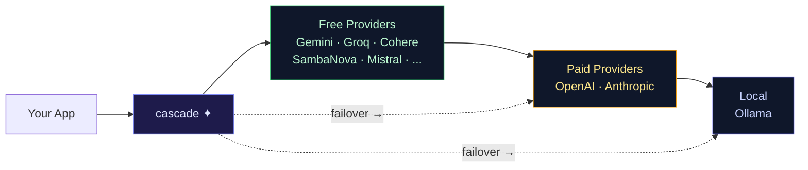

<picture>
  <source media="(prefers-color-scheme: dark)" srcset="docs/assets/cascade-cover.png">
  
</picture>

# cascade

**Intelligent AI inference routing** — failover across 15+ LLM providers with automatic fallback, key rotation, circuit breakers, and provider-aware model selection.

[](LICENSE)
[](#)
[](#supported-providers)
[](#quick-start)

cascade sits between your application and every major LLM API — trying providers in cost order, falling through when they fail, and returning the first successful response. Free tiers get priority; paid providers are the safety net.



```
⏺ Single endpoint → 15+ providers, cost-ordered, seamless failover
```

## Quick Start

```bash
curl -fsSL https://raw.githubusercontent.com/chrisluersen/cascade/main/get.sh | bash
cascade setup
```

Then use any OpenAI SDK:

```python
from openai import OpenAI
client = OpenAI(base_url="http://localhost:8319/v1", api_key="sk-cascade-1")
resp = client.chat.completions.create(model="cascade", messages=[{"role": "user", "content": "Hello!"}])
```

Or Anthropic SDK — same endpoint:

```python
import anthropic
client = anthropic.Anthropic(api_key="sk-cascade-1", base_url="http://localhost:8319")
msg = client.messages.create(model="claude-sonnet-5", max_tokens=100, messages=[{"role": "user", "content": "Hello!"}])
```

> **cascade speaks both SDKs natively.** Translate `/v1/messages` ↔ `/v1/chat/completions`, tool calls, and thinking fields transparently.

## Why cascade?

Free LLM tiers are generous but unreliable — rate limits, deprecations, and outages are the norm. cascade spreads your requests across them, tries the cheapest capable provider first, and only falls through to paid APIs when everything free is exhausted.

**The result:** free-tier reliability without single-provider lock-in. One endpoint, no SDK changes, intelligent routing.

## Features

| | |
|---|---|
| **Multi-provider failover** | 15+ providers across 6 cost tiers — free → paid → local |
| **Dual API support** | OpenAI **and** Anthropic SDK — plug-and-play, no client changes |
| **Prompt-based routing** | Keyword-matched model pinning (code→DeepSeek, creative→GPT-4o, fast→cheapest) |
| **Smart complexity routing** | Request scored 1–5, matched to capability-rated models |
| **Credential pooling** | Multiple API keys per provider, round-robin, per-key cooldown |
| **Circuit breaker** | Unhealthy providers auto-removed, re-probed after cooldown |
| **Response caching** | In-memory LRU cache (TTL-based) — saves free-tier quota |
| **Adaptive max_tokens** | Auto-scales output budget by input length |
| **Tool-aware routing** | Only tool-call requests go to providers that support function calling |
| **Payload ceiling detection** | Skips providers whose context/output limits a request exceeds |
| **Reasoning model support** | Extra token headroom for thinking models before they answer |
| **Thinking field stripping** | Removes reasoning fields that break non-Claude providers |
| **Embeddings routing** | Multi-provider with failover — Gemini, Mistral, OpenAI, Cohere |
| **Model auto-discovery** | Probes `/models` endpoint, fixes stale or renamed models |
| **Anthropic ↔ OpenAI translation** | Transparent `/v1/messages` ↔ `/v1/chat/completions` with tool mapping |
| **Observability** | Prometheus `/metrics`, `/v1/status` dashboard, per-provider latency stats |
| **Key management** | `auth.json` credential store + `.env` fallback — CLI-managed |

## Architecture

A single Python file (~2300 lines) running Flask/Waitress. One request flows through:

```
  ┌──────────┐   OpenAI-format request    ┌──────────────────────────────────────────────┐
  │ Your app │ ─────────────────────────► │                  cascade                      │
  └──────────┘   Bearer PROXY_API_KEYS    │                                              │
       ▲                                   │  1. Auth check (constant-time token compare)  │
       │                                   │  2. Cache lookup (SHA-256, LRU eviction)     │
       │         OpenAI-format response    │  3. Complexity scoring (1–5 heuristic)        │
       └────────────────────────────────► │  4. Prompt-route keyword matching             │
                                           │  5. Provider ordering (cost + capability fit) │
                                           │  6. Failover loop (key rotation → cascade)   │
                                           └──────────────────────┬───────────────────────┘
                                                                  │ first successful response
                                          ┌───────────────────────▼───────────────────────┐
                                          │ cohere  cerebras  nvidia  mistral  sambanova  │
                                          │ groq  github  gemini  openrouter  openai  ...  │
                                          │ anthropic  ollama  z.ai  naga  huggingface     │
                                          └───────────────────────────────────────────────┘
```

**Request lifecycle:**
1. Auth check against `PROXY_API_KEYS` (constant-time comparison)
2. Cache hit? Return cached response (identical requests save quota)
3. Score complexity (1=critical → 5=trivial) by token count and keywords
4. Match prompt keywords to routing rules (code, creative, fast, complex, long-context)
5. Order providers: cheapest capable model first, overkill next, underpowered last
6. Try each provider — rotate keys, handle rate limits, cascade on failure
7. Return first successful response (or `All providers exhausted`)

## Supported Providers

| Tier | Providers | Cost |
|------|-----------|------|
| **Free** | Gemini, OpenRouter (:free), SambaNova, GitHub Models, Cerebras, Groq, Mistral, Cohere, Z.ai (GLM), Naga, NVIDIA NIM, HuggingFace, Ollama | $0 |
| **Paid** | OpenAI, Anthropic, DeepSeek (via OpenRouter), Nous Portal | per-token |
| **Local** | Ollama (any local model) | $0 |

## Commands

| Command | Action |
|---|---|
| `cascade setup` | Interactive first-run: add a key, verify, start |
| `cascade start` | Start the server |
| `cascade status` | Live dashboard — per-provider health, latency, cache stats |
| `cascade auth add <provider>` | Add API keys for a provider |
| `cascade auth list` | Show all configured keys |
| `cascade model list` | Show active models per provider |
| `cascade model set <provider> <model>` | Override a provider's model |
| `cascade model reset <provider>` | Revert to default model |
| `cascade restart` | Reload config and keys |
| `cascade doctor` | Diagnose installation |
| `cascade update` | Update to the latest version |
| `cascade version` | Show installed version |

## Documentation

- **[Getting started](documentation/getting-started.md)** — zero-experience guide
- **[Usage](documentation/usage.md)** — OpenAI SDK, Anthropic SDK, tool use, embeddings
- **[Configuration](documentation/configuration.md)** — `.env` settings, `auth.json`, model overrides
- **[Providers](documentation/providers.md)** — sign-up links, capabilities, rate limits
- **[Monitoring](documentation/monitoring.md)** — `cascade status`, Prometheus `/metrics`, `/v1/status`
- **[Build an agent](documentation/build-an-agent.md)** — chatbot → memory → tools
- **[Concepts](documentation/concepts.md)** — plain-language glossary
- **[Routing spec](documentation/routing-spec.md)** — provider cascade, timeouts, model selection

## License

MIT