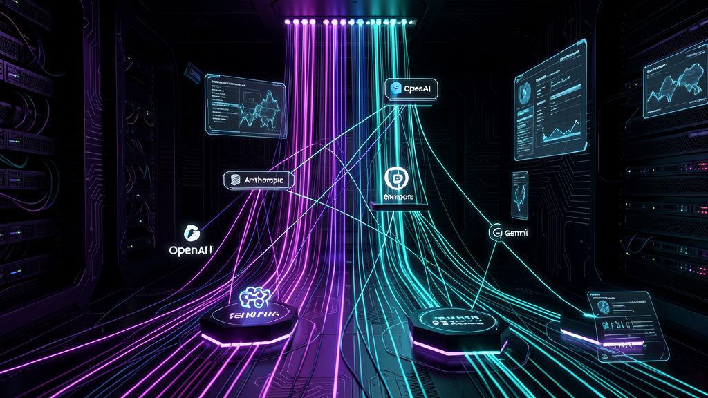
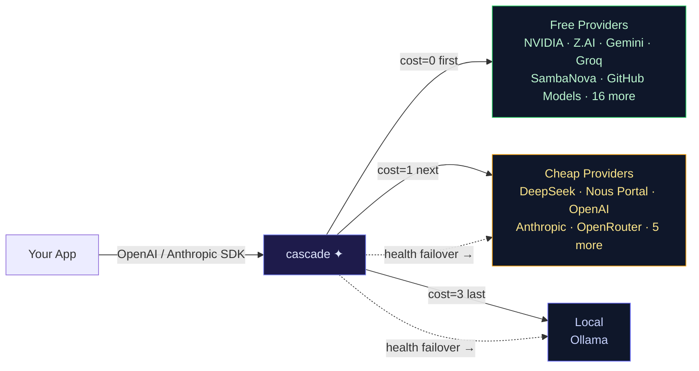

<picture>
  <source media="(prefers-color-scheme: dark)" srcset="docs/assets/cascade-cover.png">
  
</picture>

# cascade

**The cost-first smart AI router** — tries the cheapest capable provider first, fails over across 36+ LLM endpoints, and only spends money when every free option is exhausted.

[](LICENSE)
[](#)
[](#supported-providers)
[](#quick-start)
[](#bitwarden-integration)



```
⏺ One endpoint → 21+ providers, cost-ordered, seamless failover
🧠 Multi-dimensional sort key: cost × capability × latency × health × reasoning
🔐 49 API keys loaded from Bitwarden at startup — zero plaintext credentials
```

## Quick Start

```bash
curl -fsSL https://raw.githubusercontent.com/chrisluersen/cascade/main/get.sh | bash
cascade setup
```

Then use any OpenAI SDK:

```python
from openai import OpenAI
client = OpenAI(base_url="http://localhost:8319/v1", api_key="sk-cascade-1")
resp = client.chat.completions.create(model="cascade", messages=[{"role": "user", "content": "Hello!"}])
```

Or Anthropic SDK — same endpoint:

```python
import anthropic
client = anthropic.Anthropic(api_key="sk-cascade-1", base_url="http://localhost:8319")
msg = client.messages.create(model="claude-sonnet-5", max_tokens=100, messages=[{"role": "user", "content": "Hello!"}])
```

> **cascade speaks both SDKs natively.** Transparently translates between `/v1/messages` (Anthropic) and `/v1/chat/completions` (OpenAI), including tool calls and thinking fields. No client changes needed.

## Why cascade?

Free LLM tiers are generous but unreliable — rate limits, deprecations, and outages are the norm. Paid APIs deliver but cost real money. cascade sits between your app and every major LLM, making the routing decision per-request:

**Tries the cheapest capable provider first.** If it's rate-limited, unhealthy, or can't handle the request's context length, cascade fails over to the next cheapest — silently. Only when every free provider is exhausted does it touch a paid API.

**The result:** free-tier reliability without single-provider lock-in. One endpoint, no SDK changes, intelligent routing that optimizes cost without you thinking about it.

## Features

| | |
|---|---|
| **36 providers across 5 cost tiers** | Free → cheap → premium → local — 21+ unique backends, 15 via OpenRouter |
| **Multi-dimensional routing** | 11-dimension sort key: cost, capability, latency, health, reasoning support, token cost, and more |
| **Bitwarden Secrets Manager** | 49 API keys loaded at startup via `bws` — no `.env` or `auth.json` needed |
| **Dual API support** | OpenAI **and** Anthropic SDK — plug-and-play, no client changes |
| **Prompt-based routing** | Keyword-matched model pinning (code→DeepSeek, creative→GPT-4o, reasoning→Claude) |
| **Smart complexity routing** | Request scored 1–5, matched to capability-rated models (1=outstanding, 5=basic) |
| **Credential pooling** | Multiple API keys per provider, round-robin with per-key rate-limit cooldown |
| **Circuit breaker** | Unhealthy providers auto-removed from rotation, re-probed after configurable cooldown |
| **Response caching** | In-memory LRU cache (TTL-based) — saves free-tier quota on identical requests |
| **Adaptive max_tokens** | Auto-scales output budget by input length — short queries get small budgets |
| **Tool-aware routing** | Only routes tool-call requests to providers with verified function-calling support |
| **Payload ceiling detection** | Skips providers whose context/output limits a request would exceed |
| **Reasoning model support** | Extra token headroom for thinking models + transparent `thinking` field handling |
| **Embeddings routing** | Multi-provider failover — Gemini, Mistral, OpenAI, Cohere |
| **Model auto-discovery** | Probes `/v1/models` endpoint at startup, fixes stale or renamed models |
| **Anthropic ↔ OpenAI translation** | Transparent protocol bridge with tool-call mapping |
| **Observability** | Prometheus `/metrics`, `/v1/status` dashboard, per-provider latency stats |
| **Key management** | Auth via `auth.json` CLI or Bitwarden — zero plaintext keys in config |

## Architecture

A single Python file (~2800 lines) running Flask/Waitress. One request flows through:

```
  ┌──────────┐   OpenAI-format request    ┌──────────────────────────────────────────────┐
  │ Your app │ ─────────────────────────► │                  cascade                      │
  └──────────┘   Bearer PROXY_API_KEYS    │                                              │
       ▲                                   │  1. Auth check (constant-time token compare)  │
       │                                   │  2. Cache lookup (SHA-256, LRU eviction)     │
       │         OpenAI-format response    │  3. Complexity scoring (1–5 heuristic)        │
       └────────────────────────────────► │  4. Prompt-route keyword matching             │
                                           │  5. Provider ordering (11-dimension sort key) │
                                           │  6. Failover loop (key rotation → cascade)   │
                                           └──────────────────────┬───────────────────────┘
                                                                  │ first successful response
                                          ┌───────────────────────▼───────────────────────┐
                                          │ nvidia_nim  zai  gemini  sambanova_direct    │
                                          │ groq  github  deepinfra  fireworks  naga     │
                                          │ together  ovhcloud  aion  longcat  ...        │
                                          │ openrouter → deepseek-v4  sonnet-5  glm-5.2   │
                                          └───────────────────────────────────────────────┘
```

**Request lifecycle:**
1. **Auth** — constant-time token check against `PROXY_API_KEYS`
2. **Cache** — SHA-256 keyed LRU cache (identical requests skip routing)
3. **Score complexity** — 1 (critical) to 5 (trivial) based on token count and keywords
4. **Pin by prompt** — optional keyword routing (code, creative, debug, complex engineering)
5. **Sort providers** — 11-dimension sort: cost → tier → match → breaker → health → reasoning → availability → latency → token cost → fast routing
6. **Failover loop** — try each provider in order, rotate keys on rate-limit, cool down on error
7. **Return** — first successful response. If all exhausted, `All providers exhausted`

## Supported Providers

| Tier | Providers | Cost |
|------|-----------|------|
| **Free** | NVIDIA NIM (nemotron-3-super, 383ms, tools+reasoning), Z.AI (GLM-4.5-Flash, 638ms), Gemini (2.5 Flash Lite, 1M context), SambaNova Direct (DeepSeek-V3.2), Groq (Llama-3.3-70B, 800+ tok/s), GitHub Models (GPT-4o free), DeepInfra (Qwen2.5-72B), Fireworks (Qwen2.5-Coder-32B), Naga (Nemotron-3-Super:free), Together (Qwen3.5-9B), OVHcloud (gpt-oss-120b), Aion (gpt-4o-mini), LongCat, SiliconFlow, AI Hub Mix, HuggingFace, plus 10 OpenRouter free tiers | $0 |
| **Cheap** | DeepSeek V4 Flash ($0.098/M), Nous Portal (same model via Nous sub), Hy3 Preview ($0.063/M, cheapest reasoning), OpenAI (gpt-4o-mini), Mimo V2.5 ($0.105/M, 1M context), Minimax-M3 ($0.30/M, 1M context), LLM7 (devstral-small-2), Together (paid tier), Anthropic (Claude Haiku 4.5) | $0.06–$0.30/M |
| **Premium** | DeepSeek V4 Pro ($0.435/M), GLM-5.2 ($0.93/M), Claude Sonnet 5 ($2/M), Claude Sonnet 4.6 ($3/M) | $0.44–$3/M |
| **Local** | Ollama (any local model, default qwen3.5:9b) | $0 |

## Bitwarden Integration

cascade loads all API keys from **Bitwarden Secrets Manager** at startup via the `bws` CLI. No plaintext keys in `.env` or `auth.json` — just a single `BWS_ACCESS_TOKEN` in cascade's `.env`.

```
49 keys loaded at startup → 21+ providers with keys → zero plaintext credentials
```

**Key resolution cascade:**
1. `auth.json` (manual override via `cascade auth add`)
2. Bitwarden (49 secrets, loaded at startup)
3. `.env` / system environment (legacy fallback)

All sources are deduped and order-preserved. See [`documentation/bitwarden.md`](documentation/bitwarden.md) for setup guide.

## Commands

| Command | Action |
|---|---|
| `cascade setup` | Interactive first-run: add keys, verify, start |
| `cascade start` | Start the server |
| `cascade status` | Live dashboard — per-provider health, latency, cache stats |
| `cascade auth add <provider>` | Add API keys for a provider |
| `cascade auth list` | Show all configured keys |
| `cascade model list` | Show active models per provider |
| `cascade model set <provider> <model>` | Override a provider's model |
| `cascade model reset <provider>` | Revert to default model |
| `cascade restart` | Reload config and keys |
| `cascade doctor` | Diagnose installation |
| `cascade update` | Update to the latest version |
| `cascade version` | Show installed version |

## Documentation

- **[Getting started](documentation/getting-started.md)** — zero-to-running in 5 minutes
- **[Usage](documentation/usage.md)** — OpenAI SDK, Anthropic SDK, tool use, embeddings
- **[Configuration](documentation/configuration.md)** — `.env` settings, `auth.json`, model overrides
- **[Providers](documentation/providers.md)** — sign-up links, capabilities, rate limits
- **[Bitwarden setup](documentation/bitwarden.md)** — configure key management with Bitwarden Secrets Manager
- **[Monitoring](documentation/monitoring.md)** — `cascade status`, Prometheus `/metrics`, `/v1/status`
- **[Build an agent](documentation/build-an-agent.md)** — chatbot → memory → tools
- **[Concepts](documentation/concepts.md)** — plain-language glossary
- **[Routing spec](documentation/routing-spec.md)** — provider cascade, timeouts, model selection

## License

MIT