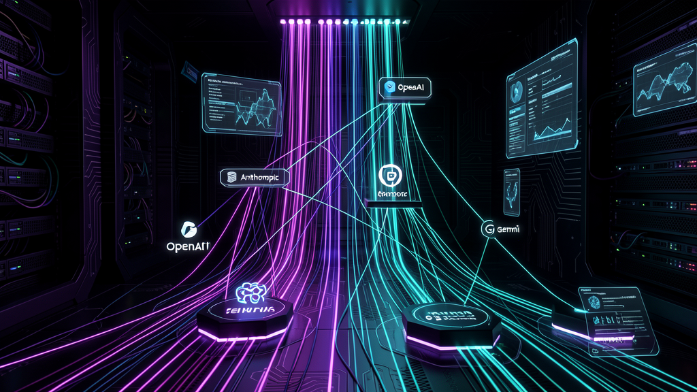
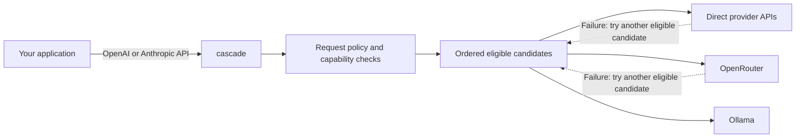

<picture>
  <source media="(prefers-color-scheme: dark)" srcset="docs/assets/cascade-cover.png">
  
</picture>

# cascade

**One local endpoint for multiple AI providers, with capability-aware routing and automatic failover.**

cascade sits between your application and hosted or local language models. Connect through the OpenAI Chat Completions or Anthropic Messages API, configure the providers you want to use, and let cascade select eligible candidates, rotate credentials, and retry upstream failures.

[](LICENSE)
[](#quick-start)
[](#connect-your-application)

[Quick start](#quick-start) · [Routing behavior](#how-routing-works) · [Providers](#supported-providers) · [Security](#configuration-and-security) · [Documentation](#documentation)

> **Routing is not a billing guarantee.** By default, capability comes before cost, so a paid candidate can be selected even when a free candidate is available. Use the explicit [free-only policy](#free-only-requests) to exclude paid and unpriced models according to the configured price table; verify your provider's actual account and quota terms separately.


```mermaid
flowchart LR
    App[Your application] -->|OpenAI or Anthropic API| Router[cascade]
    Router --> Policy[Request policy and capability checks]
    Policy --> Candidates[Ordered eligible candidates]
    Candidates --> Hosted[Direct provider APIs]
    Candidates --> Aggregator[OpenRouter]
    Candidates --> Local[Ollama]
    Hosted -.->|Failure: try another eligible candidate| Candidates
    Aggregator -.->|Failure: try another eligible candidate| Candidates
```

## Quick start

You need **Python 3.11+**, Git, and access to at least one configured provider. The example below uses an OpenAI provider key; it can incur charges. Bitwarden is optional.

### 1. Install from source

```bash
git clone https://github.com/chrisluersen/cascade.git
cd cascade
python -m venv .venv
```

Activate the environment for your shell:

```bash
# macOS / Linux (use python3 above if python is unavailable)
source .venv/bin/activate
```

```powershell
# Windows PowerShell
.\.venv\Scripts\Activate.ps1
```

Then install the server dependencies:

```bash
python -m pip install -r requirements.txt
```

### 2. Configure credentials

Create a private `.env` file in the repository root with these settings, replacing both placeholders:

```dotenv
CASCADE_API_KEY=replace-with-a-long-random-proxy-key
OPENAI_API_KEY=replace-with-your-provider-key
CASCADE_BIND_HOST=127.0.0.1
PORT=8319
CASCADE_ROUTE_LOG=./cascade-routes.jsonl
```

- **Proxy key:** `CASCADE_API_KEY` authenticates your application to cascade. There is no built-in default key; `sk-cascade-1` from older examples is not automatically accepted.
- **Provider key:** `OPENAI_API_KEY` authenticates cascade to the upstream provider. Other provider variables and model overrides are described in [configuration](documentation/configuration.md).
- Keep values unquoted in this file: cascade's minimal loader reads literal `KEY=value` pairs. Existing process environment values take precedence.
- Do not commit `.env`, `auth.json`, or logs containing sensitive information.

### 3. Start and check the server

Run from the repository root so relative configuration paths resolve correctly:

```bash
python cascade.py
```

In another terminal:

```bash
curl http://127.0.0.1:8319/health
```

On Windows, use `curl.exe` if your shell aliases `curl` to another command. The health response reports `status: "ok"` and configured provider names. It confirms that the server is responding, **not** that an upstream inference request will succeed. Startup probes can contact configured providers.

> **Installer caveat:** the repository includes `get.sh`, `install.sh`, and helper scripts, but their virtual-environment paths mix Unix and Windows layouts. The current `cascade.py` entry point does not dispatch `cascade setup`, `cascade start`, or the other previously documented CLI subcommands. Use the direct Python path above rather than those commands.

## Connect your application

Install the client library you use (`python -m pip install openai` or `python -m pip install anthropic`) in your application's environment. Set `CASCADE_API_KEY` in that application's environment to the same proxy key configured on the server. **The SDK examples do not load the server's `.env` file.**

### OpenAI SDK

```python
import os
from openai import OpenAI

client = OpenAI(
    base_url="http://127.0.0.1:8319/v1",
    api_key=os.environ["CASCADE_API_KEY"],
)
response = client.chat.completions.create(
    model="cascade",
    messages=[{"role": "user", "content": "Hello!"}],
    max_tokens=256,
)
print(response.choices[0].message.content)
```

### Anthropic SDK

```python
import os
from anthropic import Anthropic

client = Anthropic(
    base_url="http://127.0.0.1:8319",
    api_key=os.environ["CASCADE_API_KEY"],
)
response = client.messages.create(
    model="cascade",
    max_tokens=256,
    messages=[{"role": "user", "content": "Hello!"}],
)
for block in response.content:
    if block.type == "text":
        print(block.text)
```

`cascade` is the default routing alias, not an upstream model name. The Anthropic endpoint translates requests and responses; using that SDK does not mean Claude will serve the request. Streaming and tool-call translation are supported, but full parity with every SDK feature is not guaranteed. This is not an OpenAI Responses API endpoint.

### Free-only requests

For chat requests, change `model="cascade"` to **`model="cascade-free"`**. Alternatively, add this header to a chat or embeddings request:

```http
X-Cascade-Free-Only: true
```

The policy is request-scoped. Candidates must have a zero-cost provider tier and an exact zero-input/zero-output-cost model entry in the configured price table to qualify; unknown model IDs are not treated as free. When no eligible candidate can serve the request, cascade returns **503** instead of falling through to a paid model. A deployment configured only with paid models will therefore reject free-only requests.

## How routing works

The server is implemented in [`cascade.py`](cascade.py), with support modules in [`cascade_lib/`](cascade_lib/), using Flask and Waitress.

1. **Authenticate** using the proxy key, supplied as a Bearer token or `x-api-key`.
2. **Check the cache** for non-streaming requests, scoped by endpoint family and free-only policy.
3. **Apply routing preferences** using request complexity, keyword rules, and configured model matches. Prompt rules can alter model selection; do not treat a model name alone as a strict isolation policy.
4. **Order eligible candidates** by capability tier before cost, with further routing preferences and weaker candidates retained as fallbacks. Free-only and tool-support checks constrain eligibility.
5. **Attempt and fail over** with per-key cooldowns, provider circuit breakers, and payload-limit handling. Authentication failures can rotate to another key; provider failures move to another candidate.
6. **Return a response or an error.** Detected error objects inside successful HTTP responses, including the first SSE data event, trigger failover before a response is handed to the client. This does not guarantee recovery from errors later in an already-started stream.

Capability scores and prices are configured heuristics, not quality benchmarks or live billing data. Failover improves resilience; it cannot guarantee an answer when every eligible provider fails.

## Features and boundaries

| Feature | Behavior |
|---|---|
| Dual API surface | OpenAI Chat Completions and Anthropic Messages, including streaming and tool-call translation |
| Credential pooling | Multiple keys per provider, key rotation, and cooldowns for rate limits or invalid credentials |
| Tool-aware routing | Nonempty `tools` requests require probed support or an explicit operator override; no eligible support returns 503 |
| Response caching | In-memory LRU with TTL; restart after routing, catalog, or policy changes to discard old entries |
| Payload management | Adaptive output budgets, provider context/output ceilings, and reasoning-field handling |
| Embeddings | Failover across configured embedding providers; vector dimensions and semantics can differ between models |
| Observability | Provider health, latency, cache statistics, estimated costs, Prometheus metrics, and route traces |

## Supported providers

The source catalog includes direct integrations such as **OpenAI, Anthropic, Gemini, Groq, NVIDIA NIM, SambaNova, Z.AI, DeepInfra, Fireworks, Together, and Hugging Face**, plus **OpenRouter** candidates and **Ollama** for local inference.

Only configured candidates participate. Availability depends on credentials, account access, model IDs, quotas, and health checks—not the size of the catalog. See the [provider guide](documentation/providers.md) for setup pointers and [`_build_providers()`](cascade.py) for the current configured defaults. Verify model availability and pricing with your provider before deployment.

## Configuration and security

- **Keep the two kinds of keys separate.** Clients receive the cascade proxy key, not upstream provider credentials. `CASCADE_API_KEY` can contain comma-separated proxy keys; Bitwarden can also supply a proxy key.
- **Provider credentials are merged, not exclusive overrides.** The lookup order is `auth.json` → Bitwarden Secrets Manager → environment, with duplicates removed and order preserved. A key in `auth.json` does not disable keys from other sources.
- **Bitwarden is optional.** Startup loading requires the `bws` CLI and `BWS_ACCESS_TOKEN`. Local `.env` and `auth.json` files are plaintext; protect their permissions and keep them out of version control.
- **Review inherited configuration.** If `BWS_ACCESS_TOKEN` is unset, startup also attempts to load `~/AppData/Local/hermes/.env`. Check the deployment's environment and credential sources before starting it.
- **Bind locally by default.** `CASCADE_BIND_HOST` defaults to `127.0.0.1`. If exposing the service remotely, add TLS and appropriate network access controls; the server itself serves HTTP.
- **Do not assume tenant isolation.** The response cache does not promise per-user isolation. Review caching and logging before serving mutually untrusted clients.

See [configuration](documentation/configuration.md) for provider variables and [development notes](documentation/development.md) for cache and offline-mode boundaries.

## Health and troubleshooting

| Endpoint | Purpose | Authentication |
|---|---|---|
| `GET /health` | Server liveness and configured provider names | None |
| `GET /v1/models` | Configured routing alias, not the full upstream catalog | Proxy key |
| `GET /v1/status` | Provider state and runtime statistics | Proxy key |
| `GET /metrics` | Prometheus metrics | None by default; set `METRICS_REQUIRE_AUTH=1` to require the proxy key |

- **401 Unauthorized:** ensure the client key matches a configured `CASCADE_API_KEY`. The old example key is not a default.
- **503 / all providers exhausted:** check provider credentials, model access, quotas, cooldowns, and server logs. A successful `/health` response is not proof of provider readiness.
- **503 on free-only or tool requests:** confirm at least one configured candidate satisfies that policy. Do not remove the policy unless you intend to permit different cost or capability behavior.
- **Configuration changes not taking effect:** check inherited environment values, then stop and restart `python cascade.py`. This also clears the in-memory response cache.

## Development

Use your approved Python environment with the runtime dependencies and `pytest` available, then run:

```bash
python -m pytest -q
```

Default collection targets `tests/`. Its router fixture uses `CASCADE_OFFLINE=1`, synthetic credentials, and blocked HTTP requests. The root-level `test_cascade.py` and `test_route_log.py` are legacy probes, not offline test gates. Passing the offline suite does **not** verify live provider access, SDK compatibility, Docker deployment, or billing. See [development and verification](documentation/development.md) for the full procedure.

## Documentation

| Guide | Contents |
|---|---|
| [Usage](documentation/usage.md) | SDK examples, tool use, and embeddings |
| [Configuration](documentation/configuration.md) | Environment settings, credentials, and model overrides |
| [Providers](documentation/providers.md) | Provider setup pointers and capabilities |
| [Routing specification](documentation/routing-spec.md) | Selection, timeouts, and failover |
| [Monitoring](documentation/monitoring.md) | Status and metrics |
| [Development and verification](documentation/development.md) | Offline tests and evaluation receipts |
| [Build an agent](documentation/build-an-agent.md) | Chat, memory, and tools |
| [Concepts](documentation/concepts.md) | Plain-language glossary |
| [Changelog](CHANGELOG.md) | Change history |

Some guides still contain older CLI, default-key, or free-first examples. Use this README's quick start and routing/security notes when those examples conflict with current behavior.

## License

[MIT](LICENSE).