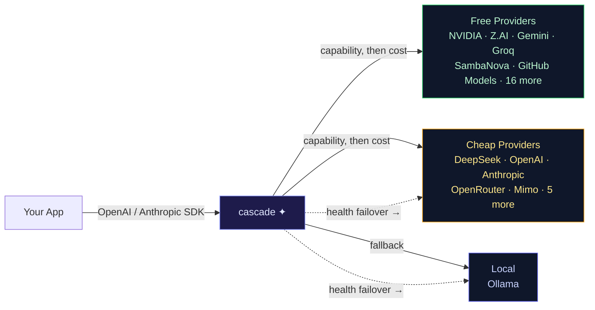

<picture>
  <source media="(prefers-color-scheme: dark)" srcset="docs/assets/cascade-cover.png">
  
</picture>

# cascade

**A capability-aware AI router** — prefers capable candidates, then cost within that tier; weaker candidates remain fallbacks. Explicit model pins retain their existing behavior. Free-tier billing depends on provider, account, and quota configuration.

[](LICENSE)
[](#)
[](#supported-providers)
[](#quick-start)
[](#bitwarden-integration)
[](#)
[](#)
[](#)
[](#)


```mermaid
flowchart LR
    App[Your App]
    C[cascade ✦]
    F[Free Providers<br/>NVIDIA · Z.AI · Gemini · Groq<br/>SambaNova · GitHub Models · 16 more]
    P[Cheap Providers<br/>DeepSeek · OpenAI · Anthropic<br/>OpenRouter · Mimo · 5 more]
    L[Local<br/>Ollama]
    App -->|"OpenAI / Anthropic SDK"| C
    C -->|"capability, then cost"| F
    C -->|"capability, then cost"| P
    C -->|"fallback"| L
    C -. "health failover →" .-> P
    C -. "health failover →" .-> L
    style C fill:#1e1b4b,stroke:#818cf8,color:#e0e7ff
    style F fill:#0f172a,stroke:#22c55e,color:#bbf7d0
    style P fill:#0f172a,stroke:#f59e0b,color:#fde68a
    style L fill:#0f172a,stroke:#6366f1,color:#c7d2fe
```

```
⏺ One endpoint → provider candidates with failover
🧠 Multi-dimensional sort key: capability tier before cost tier
🔐 Credential sources include local configuration and optional secret-manager integration
```

## Quick Start

```bash
curl -fsSL https://raw.githubusercontent.com/chrisluersen/cascade/main/get.sh | bash
cascade setup
```

Then use any OpenAI SDK:

```python
from openai import OpenAI
client = OpenAI(base_url="http://localhost:8319/v1", api_key="sk-cascade-1")
resp = client.chat.completions.create(model="cascade", messages=[{"role": "user", "content": "Hello!"}])
```

Or Anthropic SDK — same endpoint:

```python
import anthropic
client = anthropic.Anthropic(api_key="sk-cascade-1", base_url="http://localhost:8319")
msg = client.messages.create(model="claude-sonnet-5", max_tokens=100, messages=[{"role": "user", "content": "Hello!"}])
```

> **cascade speaks both SDKs natively.** Transparently translates between `/v1/messages` (Anthropic) and `/v1/chat/completions` (OpenAI), including tool calls and thinking fields. No client changes needed.

## Why cascade?

Free LLM tiers are generous but unreliable — rate limits, deprecations, and outages are the norm. Paid APIs deliver but cost real money. cascade sits between your app and every major LLM, making the routing decision per-request:

**Prefers capable candidates, then cost within that tier; weaker candidates remain fallbacks.** If a candidate is unavailable or cannot handle the request, cascade tries other eligible candidates. This heuristic does not prove response quality; paid use can increase even while free candidates remain. Free-only routing is an explicit request policy, subject to the configured model prices and the provider's actual billing terms.

**The goal:** one endpoint with candidate failover. Validate cost and provider behavior for your own deployment before relying on free-tier routing.

## Features

| | |
|---|---|
| **Provider catalog** | Configured free, paid, and local candidates; availability and quotas vary |
| **Multi-dimensional routing** | Capability tier before cost tier; cost is preferred within a capability tier, with weaker fallback candidates |
| **Bitwarden Secrets Manager** | Optional secret source alongside local credential configuration |
| **Dual API support** | OpenAI **and** Anthropic SDK — plug-and-play, no client changes |
| **Prompt-based routing** | Keyword-matched model pinning (code→DeepSeek, creative→GPT-4o, reasoning→Claude) |
| **Smart complexity routing** | Request scored 1–5, matched to capability-rated models (1=outstanding, 5=basic) |
| **Credential pooling** | Multiple API keys per provider, round-robin with per-key rate-limit cooldown |
| **Circuit breaker** | Unhealthy providers auto-removed from rotation, re-probed after configurable cooldown |
| **Response caching** | In-memory LRU cache (TTL-based), scoped by endpoint and free-only policy; restart after routing or catalog changes |
| **Adaptive max_tokens** | Auto-scales output budget by input length — short queries get small budgets |
| **Tool-aware routing** | Nonempty modern `tools` requests require probed support or an explicit operator override; absent support returns 503 |
| **Payload ceiling detection** | Skips providers whose context/output limits a request would exceed |
| **Reasoning model support** | Extra token headroom for thinking models + transparent `thinking` field handling + per-provider `reasoning_effort` control (`<PROVIDER>_REASONING_EFFORT`) |
| **Embeddings routing** | Multi-provider failover — Gemini, Mistral, OpenAI, Cohere |
| **Model auto-discovery** | Probes `/v1/models` endpoint at startup, fixes stale or renamed models |
| **Anthropic ↔ OpenAI translation** | Transparent protocol bridge with tool-call mapping |
| **Observability** | Prometheus `/metrics`, `/v1/status` dashboard, per-provider latency stats |
| **Key management** | Auth via `auth.json` CLI or Bitwarden — zero plaintext keys in config |

## Architecture

A main server module (`cascade.py`) plus support libraries (`cascade_lib/`) running Flask/Waitress. One request flows through:

```
  ┌──────────┐   OpenAI-format request    ┌──────────────────────────────────────────────┐
  │ Your app │ ─────────────────────────► │                  cascade                      │
  └──────────┘   Bearer PROXY_API_KEYS    │                                              │
       ▲                                   │  1. Auth check (constant-time token compare)  │
       │                                   │  2. Cache lookup (SHA-256, LRU eviction)     │
       │         OpenAI-format response    │  3. Complexity scoring (1–5 heuristic)        │
       └────────────────────────────────► │  4. Prompt-route keyword matching             │
                                           │  5. Provider ordering (11-dimension sort key) │
                                           │  6. Failover loop (key rotation → cascade)   │
                                           └──────────────────────┬───────────────────────┘
                                                                  │ first successful response
                                          ┌───────────────────────▼───────────────────────┐
                                          │ nvidia_nim  zai  gemini  sambanova_direct    │
                                          │ groq  github  deepinfra  fireworks  naga     │
                                          │ together  ovhcloud  aion  longcat  ...        │
                                          │ openrouter → deepseek-v4  sonnet-5  glm-5.2   │
                                          └───────────────────────────────────────────────┘
```

**Request lifecycle:**
1. **Auth** — constant-time token check against `PROXY_API_KEYS`
2. **Cache** — SHA-256 keyed LRU cache (identical requests skip routing)
3. **Score complexity** — 1 (critical) to 5 (trivial) based on token count and keywords
4. **Pin by prompt** — optional keyword routing (code, creative, debug, complex engineering)
5. **Sort providers** — capability tier → cost tier → further routing preferences; explicit pins retain their existing behavior and weaker candidates remain fallbacks
6. **Failover loop** — try each provider in order, rotate keys on rate-limit, cool down on error
7. **Return** — first successful response. If all exhausted, `All providers exhausted`

## Supported Providers

| Tier | Providers | Cost |
|------|-----------|------|
| **Free** | NVIDIA NIM, Z.AI, Gemini, SambaNova Direct, Groq, GitHub Models, DeepInfra, Fireworks, Naga, OVHcloud, Aion, LongCat, SiliconFlow, HuggingFace, and selected OpenRouter models | Configured free tier; verify account and quota |
| **Cheap** | DeepSeek V4 Flash ($0.098/M), Hy3 Preview ($0.063/M, cheapest reasoning), OpenAI (gpt-4o-mini), Mimo V2.5 ($0.105/M, 1M context), Minimax-M3 ($0.30/M, 1M context), LLM7 (devstral-small-2), Together (paid tier), Anthropic (Claude Haiku 4.5) | $0.06–$0.30/M |
| **Premium** | DeepSeek V4 Pro ($0.435/M), GLM-5.2 ($0.93/M), Claude Sonnet 5 ($2/M), Claude Sonnet 4.6 ($3/M) | $0.44–$3/M |
| **Local** | Ollama (local model) | Local compute; not an upstream billing guarantee |

Provider/model names and prices above reflect existing configuration, not a fresh provider certification or live benchmark. Exact model IDs must be present in the price table for free-only eligibility; unknown aliases are unpriced, not free. Previously substring-matched aliases can drop out of free-only routing until an exact entry is verified.

## Bitwarden Integration

cascade can load API keys from **Bitwarden Secrets Manager** at startup via the `bws` CLI when configured. Local `auth.json` and environment-based credentials are also supported; protect them appropriately.

```
Configured keys → eligible provider candidates
```

**Key resolution cascade:**
1. `auth.json` (manual override via `cascade auth add`)
2. Bitwarden (when configured)
3. `.env` / system environment (legacy fallback)

Key names are resolved through three strategies: exact match → singular form (strip trailing 'S') → alias table (`_BW_ENV_ALIASES`), bridging gaps between Bitwarden key names and cascade's internal env var names. All sources are deduped and order-preserved. See [configuration](documentation/configuration.md) for key settings.

## Commands

| Command | Action |
|---|---|
| `cascade setup` | Interactive first-run: add keys, verify, start |
| `cascade start` | Start the server |
| `cascade status` | Live dashboard — per-provider health, latency, cache stats |
| `cascade auth add <provider>` | Add API keys for a provider |
| `cascade auth list` | Show all configured keys |
| `cascade model list` | Show active models per provider |
| `cascade model set <provider> <model>` | Override a provider's model |
| `cascade model reset <provider>` | Revert to default model |
| `cascade restart` | Reload config and keys |
| `cascade doctor` | Diagnose installation |
| `cascade update` | Update to the latest version |
| `cascade version` | Show installed version |

## Documentation

- **[Getting started](documentation/getting-started.md)** — zero-to-running in 5 minutes
- **[Usage](documentation/usage.md)** — OpenAI SDK, Anthropic SDK, tool use, embeddings
- **[Configuration](documentation/configuration.md)** — `.env` settings, `auth.json`, model overrides
- **[Providers](documentation/providers.md)** — sign-up links, capabilities, rate limits
- **[Development and verification](documentation/development.md)** — deterministic offline suite and evaluation receipts
- **[Monitoring](documentation/monitoring.md)** — `cascade status`, Prometheus `/metrics`, `/v1/status`
- **[Build an agent](documentation/build-an-agent.md)** — chatbot → memory → tools
- **[Concepts](documentation/concepts.md)** — plain-language glossary
- **[Routing spec](documentation/routing-spec.md)** — provider cascade, timeouts, model selection

## License

MIT